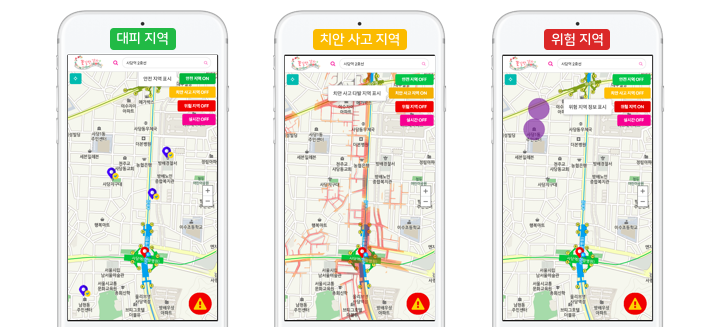
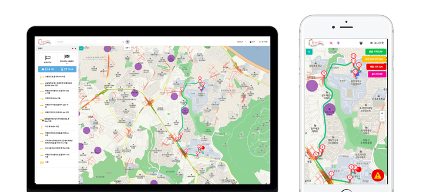
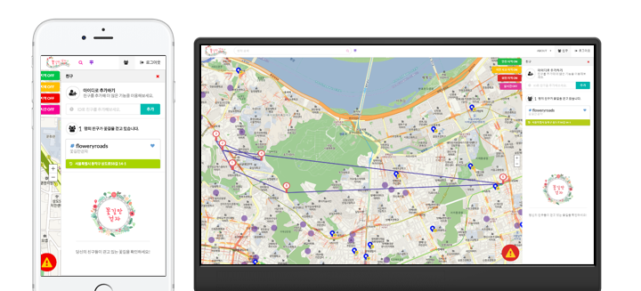
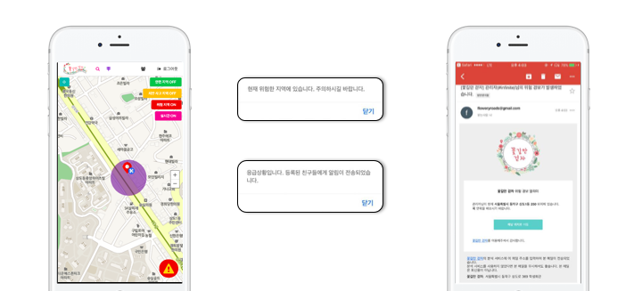
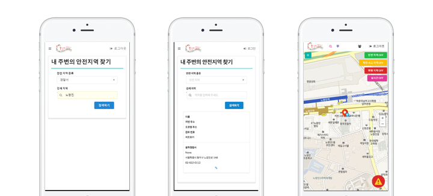
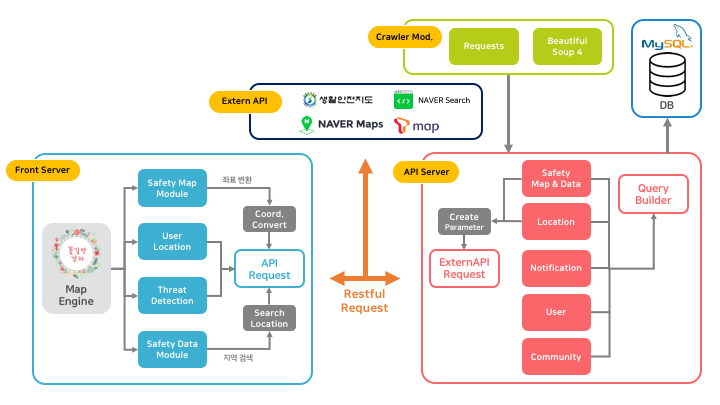

**꽃길만 걷자(FloweryRoads)**
===================

**Introduce**
-------------

`꽃`길과는 다르게 우리의  
`길`은 많은 위험 속에 노출되어 있습니다.  
`만`약에 이러한 길을 꽃길로 바꿔준다면,  
`걷`고 싶은 길이 탄생하지 않을까요?  
`자`, 꽃길만 걷자와 안전하게 걸어보세요!  

>**[꽃길만 걷자](https://floweryroads.io)** 는 여성들 및 어린아이 같은 사회적 약자를 위한 오픈 소스 **맞춤 범죄 예방 지도 앱**입니다.
 

**Source Code**
-------------
꽃길만 걷자는 다음 프로젝트들로 이루어져있습니다. 
아래의 해당 Repository에서 소스코드를 확인하실 수 있습니다.

- **[Front](https://github.com/FloweryRoads/FloweryRoads-Front)** : 꽃길만 걷자 Front Server
- **[API](https://github.com/FloweryRoads/FloweryRoads-API)** : 꽃길만 걷자 API Server
- **[Crawler](https://github.com/FloweryRoads/FloweryRoads-Crawler)** : 꽃길만 걷자 Data Crawler Module
- **[SafetyDataAPI](https://github.com/FloweryRoads/FR-SafetyData-API)** : 꽃길만 걷자 Safety Data API -> 현재 개발 진행중 

**Demo**
-------------
 

**Overview**
-------------

**1. 안전 지도 및 길찾기**  

* 안전 지도
	- 안전 지역 Filter : 비상 시 대피할 수 있는 안전 지역을 핀으로 표시
	- 치안 사고 지역 Filter : 5대 범죄(강도, 살인, 성범죄, 절도, 폭력) 다발 지역을 이미지로 표시 
	- 위험 지역 Filter : 실제 성범죄자가 사는 곳의 반경 50m를 원으로 표시 

* 길찾기 : 출발지와 목적지 간의 범죄가 덜 일어날 법한 큰길 위주의 길찾기를 제공

**2. 가족 및 친구 위치 정보 공유**  

주기적으로 자신의 위치를 수집하고, 이 정보를 가족 및 친구에게 공유함으로써 주변 사람들에게 자신이 안전함을 알릴 수 있다.

**3. 실시간 위험 탐지 제공**  

사용자가 해당 위험 구역에 접근하면 알림 창을 보여줘 자신이 위험 지역에 있다는 점을 상기시켜주고, 일정 시간 위험 지역에 머물게 된다면 등록된 가족 및 친구에게 경보 메일을 발송해준다.

**4. 안전지역 정보 제공**

사용자가 확인하고자 하는 안전지역 기관을 선택하고, 검색하고자 하는 지역명을 입력하면 해당 지역 주위의 기관의 세부 정보 및 위치 정보를 쉽게 확인 할 수 있도록 지도와 함께 보여준다.

**Architecture**
-------------
**꽃길만 걷자**는 아래의 architecture로 구성되어 있습니다. 

**Deploy**
-------------
* [uWSGI](https://uwsgi-docs.readthedocs.io/en/latest/)
* [Nginx](https://nginx.org/en/)  

**Design**
-------------
* Logo & Web View design by **`Bokyung`**
* [Semantic-UI](http://semantic-ui.com/)
* PIN img : [FLATICON](https://www.flaticon.com/) 
* Index & Login page background-img : [PEXELS](https://www.pexels.com)

**Issue**
-------------
사용시, 문제점 혹은 궁금한 점이 있으시면 아래 링크에 이슈를 남겨주세요.  

- [Front Issue](https://github.com/FloweryRoads/FloweryRoads-Front/issues)   
- [API Issue](https://github.com/FloweryRoads/FloweryRoads-API/issues)   
- [Crawler Issue](https://github.com/FloweryRoads/FloweryRoads-Crawler/issues)   

**Contribution**
-------------
함께 꽃길을 만들어 나가실 **Contiribution**은 언제나 환영합니다. 

**Prototype**
-------------
- Web

- Mobile

**API Reference**
-------------
- [NAVER Maps API v3](https://navermaps.github.io/maps.js)
- [NAVER Search API](https://developers.naver.com/docs/search/local/)
- [T map API](https://developers.skplanetx.com/apidoc/kor/tmap)
- [생활안전정보 Open Data API ](http://www.safemap.go.kr/cmm/main/mainPage.do)

**License**
-------------
FloweryRoads is released under the [GNU license](https://github.com/FloweryRoads/FloweryRoads/FloweryRoads-blob/master/LICENSE).

